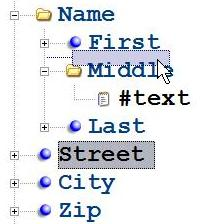

## Drag/Drop Support

You can drag and drop nodes from the tree view to move them around inside the document or across documents using multiple instances of XML Notepad. (Note: You can easily create a new instance of XML Notepad by selecting the Window/New Window menu item). You can also drag an XML file from Windows Explorer onto XML Notepad as a quick way to open that file.

When you Drag/Drop nodes across programs, it uses the same text format as [Cut/Copy/Paste](clipboard.md).

When dragging the selected element a shadow node will appear in the tree that moves with the cursor showing you where the node will be moved to.  In the example below, the "Street" element is being dragged to a new location after the "First" element and before the "Middle" element:

When you hover the mouse over a collapsed node it is automatically expanded just in case you are trying to drop the node inside that collapsed container and conversely, when you hover over an expanded node it is automatically collapsed so that you can easily find nodes above or below that container.

Dragging is a move operation by default, even across XML Notepad instances, which means if you drag a node from one XML Notepad instance to another it will be removed from the first instance.  If you want to perform a copy operation, hold down the CONTROL key.

See [Keyboard](keyboard.md) for more information.